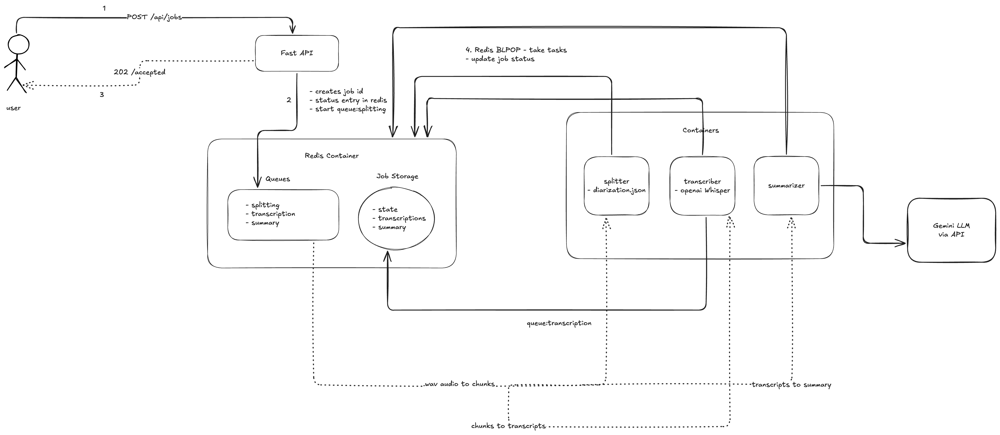

# Polygraf Meeting Summarizer

> A scalable, asynchronous Python backend that turns long meeting recordings into accurate transcripts and concise, AI-generated summaries.

This system is built on a distributed, queue-based architecture using Redis and Docker. It can process large audio/video files in the background without blocking the user, providing a job ID to track progress and retrieve the final results.

[](https://fastapi.tiangolo.com/)
[](https://redis.io/)
[](https://docs.docker.com/compose/)
[](https://github.com/openai/whisper)
[](https://ai.google.dev/)

---

## What it does

- Accepts **mp4/wav** meeting recordings + a **speaker diarization JSON**
- Splits audio into chunks, **transcribes** with Whisper, and **summarizes** via Google Gemini
- Scales horizontally with **multiple workers** coordinated by **Redis queues**
- Provides **non-blocking** API: submit a job, **poll by `job_id`**, retrieve results when done

---

## Core Principle

- **The API does no heavy work** — it only accepts jobs and reports status.
- **Redis** is the central hub for queues, job state, and results.
- **Workers** do the compute (splitting → transcription → summarization) asynchronously.

---

## 🏗️ System Architecture



**Pipeline (3 Workers via Redis):**

1. **Worker A – Splitter**
   - Extracts audio from video (if needed)
   - Reads diarization JSON and splits the audio into **N** chunks
   - Enqueues **N** transcription tasks

2. **Worker B – Transcriber**
   - Processes each chunk from the transcription queue
   - Runs **Whisper** to produce text
   - Appends text fragments to Redis and increments `processed_chunks`
   - On last chunk, enqueues a final **summary** task

3. **Worker C – Summarizer**
   - Fetches all transcript fragments
   - Formats prompt + calls **Google Gemini**
   - Stores the final JSON summary in Redis and marks the job **complete**

---

## 🧰 Tech Stack

- **API**: FastAPI (Uvicorn)
- **Queues & State**: Redis
- **Transcription**: OpenAI Whisper
- **Summarization**: Google Gemini
- **Media I/O**: pydub, MoviePy
- **Containerization**: Docker & Docker Compose

> Compose services: `redis`, `api`, `worker-splitter`, `worker-transcriber`, `worker-summarizer`.

---

## 📦 Repository

- GitHub: <https://github.com/Manishrdy/polygraf_python_assessment>

---

## 📁 Project Layout (high-level)
```
.
├── app/
│   ├── main.py                 # FastAPI app (routes: /jobs, /jobs/{job_id})
│   ├── routes/
│   │   ├── jobs.py
│   ├── services/
│   │   ├── audio_extractor.py
│   │   ├── consumer.py
│   │   ├── redis_service.py
│   │   ├── transcriber.py
│   ├── workers/
│   │   ├── splitter.py
│   │   ├── transcriber.py
│   │   └── summarizer.py
├── data/                       # Create this folder in root            
│   ├── audio.wav               # Add your audio.wav 
│   ├── diarization.json        # Add your diarization.json
├── logs/
├── architecture.png            # Architecture diagram (shown above)
├── docker-compose.yaml         # Multi-service definition
├── .env.example                # Example environment file (see below)
└── README.md
```

---

## Requirements

- **Docker Desktop** (or Docker Engine + Compose)
- **API keys** for **Google Gemini**
- Sufficient CPU/GPU for Whisper (CPU works; GPU recommended for large files)

---

## Environment Setup

Create a `.env` file at the repo root:

```env
# -- App Config --
APP_ENV=development

# -- API Keys (Required) --
GEMINI_API_KEY=AIzaSy...                # Required
GENAI_MODEL=gemini-2.5-flash

LOG_LEVEL=INFO
API_PORT=8000
WHISPER_MODEL=base
```
---

## Docker
```
# Build images and start all services
docker compose up --build -d

# View logs
docker compose logs -f

# View all servicers
docker compose ps

# Stop and remove container
docker compose down

# Delete docker images
docker compose down --volumes --rmi all   

#Reclaim storage
docker system prune -a
```

## API Endpoints

- Colletion: <https://grey-moon-445797.postman.co/workspace/Manish~283d32b7-e13d-4cd5-a9d8-96c6fb685e4b/collection/17079845-59e50f92-a031-432a-9313-b023d340143a?action=share&creator=17079845>

## Final Output
```
{
  "job_id": "330b989e-1f0a-4f35-8199-1670c4a42bc6",
  "status": "complete",
  "summary": {
    "keypoints": ["..."],
    "decisions": ["..."],
    "action_items": ["..."]
  },
  "per_person": {
    "Interviewer": [
      "Hi, Manish. So welcome...",
      "How do you approach design?"
    ],
    "Manish Reddy": [
      "Thank you...",
      "What are your core goals..."
    ]
  },
  "speakers": [
    "Interviewer",
    "Manish Reddy"
  ],
  "counts": {
    "Interviewer": 28,
    "Manish Reddy": 37
  }
}
```
